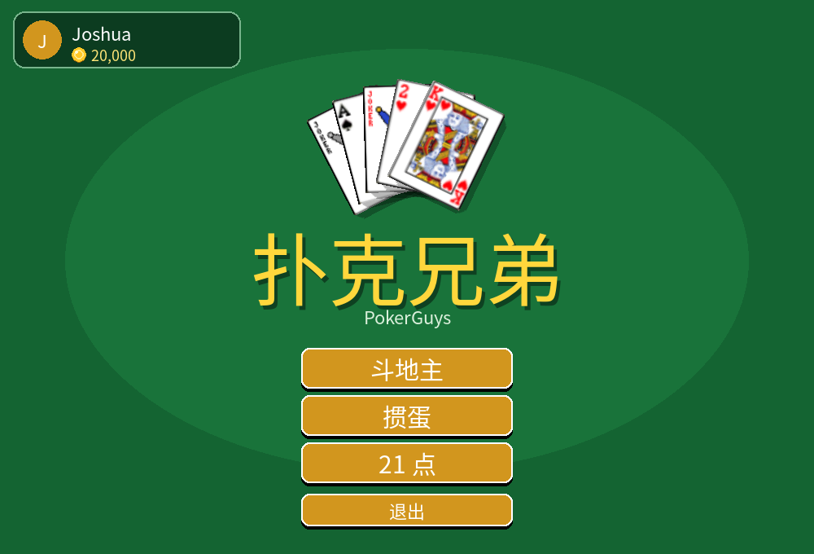
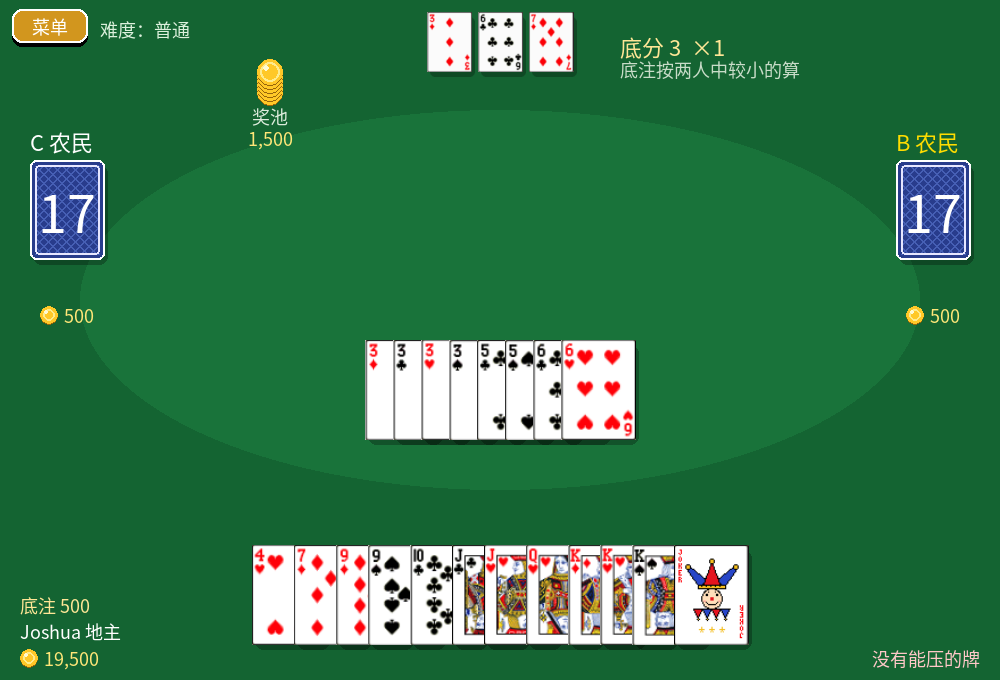
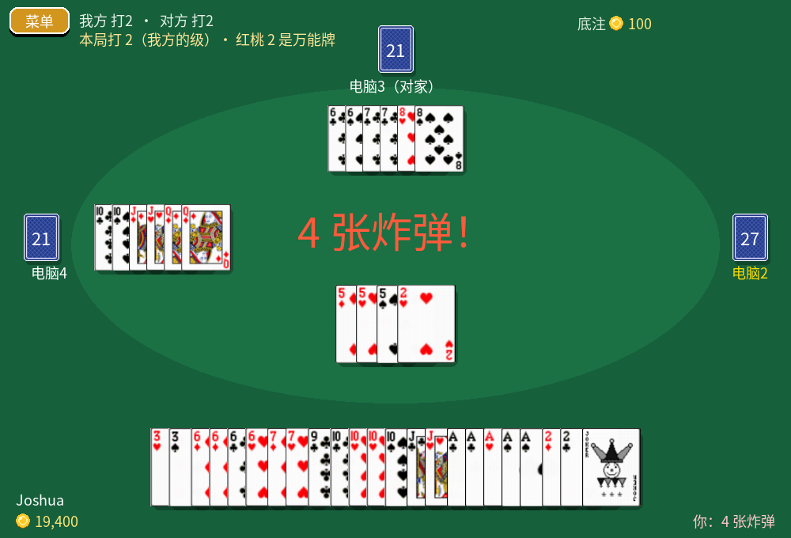
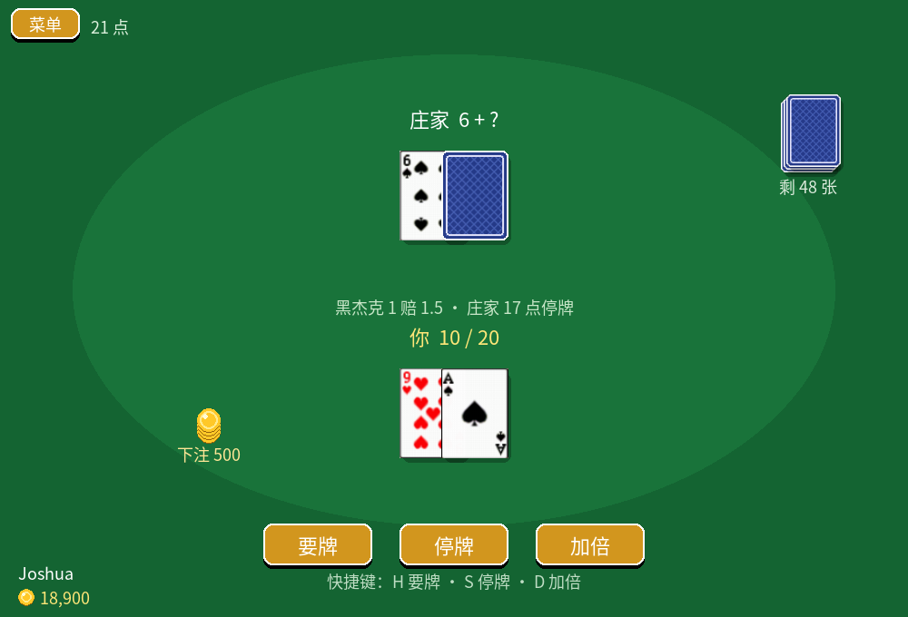

<div align="center">


# 扑克兄弟 PokerGuys

**斗地主 · 掼蛋 · 21 点 —— 一个装下三种玩法的扑克游戏**

单机打电脑，或者和同一个 WiFi 下的朋友联机

[](https://github.com/JoshuaMaoJH/PokerGuys-releases/releases/latest)
[](https://github.com/JoshuaMaoJH/PokerGuys-releases/releases)


### [⬇️ 下载最新版](https://github.com/JoshuaMaoJH/PokerGuys-releases/releases/latest)



</div>

---

## 🃏 三种玩法

### 斗地主



- 完整牌型：单张、对子、三带一/三带二、顺子、连对、飞机带翅膀、四带二、炸弹、王炸
- 叫地主（1/2/3 分），地主拿底牌时有插牌动画
- 电脑三档难度：
  - **简单**：出牌随心所欲，适合练手
  - **普通**：会配合队友，懂得留炸弹和大牌
  - **困难**：会记牌，残局会推演每一种出法
- 支持 3 人局域网联机，人不够电脑补上

### 掼蛋



- 两副牌、4 人、对家是队友，按完整规则来：
  - 打级牌，**红桃级牌是万能牌**（逢人配）
  - 木板（连对）、钢板（飞机）、同花顺、四王炸
  - 接风、升级（双下升 3 级、头游+三游升 2 级、头游+末游升 1 级）
  - 进贡、还贡、抗贡
- 单机：你和 3 个电脑打；联机：4 人一桌，人不够电脑补上

### 21 点



- 要牌、停牌、加倍，庄家 17 点停牌
- 黑杰克 1 赔 1.5

## 💰 金币和钱庄

- 新玩家送 **10,000 金币**，三种玩法共用一个钱包
- 每局开始前自己选底注，赢了拿走别人的注，输了赔给赢家
- 斗地主里叫的分和炸弹会让输赢翻倍，翻倍在结算时才算
- 输光了可以去主菜单左上角的**钱庄**借钱。借了要还，**每打一局利息涨 3%**（利滚利）；之后赢了钱会自动拿一半还债

金币只是游戏里的数字，不能充值，也不能提现。

## ⬇️ 下载哪个？

到 [Releases 页面](https://github.com/JoshuaMaoJH/PokerGuys-releases/releases/latest) 按系统下载：

| 系统 | 下载这个 | 怎么装 |
|---|---|---|
| **Windows 10/11** | `PokerGuys-*-windows-setup.exe` | 双击安装，桌面和开始菜单里会出现「扑克兄弟」 |
| Windows（免安装） | `PokerGuys-*-windows-portable.zip` | 解压，运行里面的 `PokerGuys.exe` |
| **macOS**（M1 及以后的 Apple 芯片） | `PokerGuys-*-macos-arm64.dmg` | 打开后把 PokerGuys 拖进「应用程序」 |
| **Ubuntu / Debian** | `pokerguys_*_amd64.deb` | `sudo apt install ./pokerguys_*_amd64.deb` |
| 其他 Linux | `PokerGuys-*-x86_64.AppImage` | `chmod +x PokerGuys-*.AppImage` 后双击运行 |

## 🎮 操作

| 操作 | 鼠标 | 键盘 |
|---|---|---|
| 选牌 / 取消选牌 | 左键点牌 | — |
| 清空已选的牌 | 右键 | `Esc` |
| 出牌 | 「出牌」按钮 | `Enter` |
| 不出 | 「不出」按钮 | `空格` |
| 提示 | 「提示」按钮 | `H` |
| 叫分（斗地主） | 点按钮 | `0` `1` `2` `3` |
| 要牌 / 停牌 / 加倍（21 点） | 点按钮 | `H` / `S` / `D` |
| 再来一局 | 点按钮 | `R` |

## 🌐 联机

1. 所有人连**同一个 WiFi / 局域网**
2. 一个人选好玩法后点「联机」→「创建房间」，屏幕上会显示要输入的地址
3. 其他人点「联机」→「加入房间」，输入这个地址
4. 人齐了（或者不想等了，空位电脑补），房主点「开始游戏」

联机用的端口：斗地主 `23456`，掼蛋 `23457`。电脑弹出防火墙提示时，选「允许」。

## ❓ 常见问题

<details>
<summary><b>Windows 提示「Windows 已保护你的电脑」</b></summary>

游戏没有买代码签名证书，所以 Windows 不认识它。点「**更多信息**」，再点「**仍要运行**」。
</details>

<details>
<summary><b>mac 提示「无法打开，因为无法验证开发者」</b></summary>

在「应用程序」里找到 PokerGuys，**右键 → 打开**，在弹窗里再点「打开」。只有第一次需要这样做。

还是打不开的话，在「终端」里运行：
```bash
xattr -cr /Applications/PokerGuys.app
```
</details>

<details>
<summary><b>Linux 上 AppImage 双击没反应</b></summary>

先给它运行权限：`chmod +x PokerGuys-*.AppImage`。如果提示缺 FUSE，Ubuntu 上运行 `sudo apt install libfuse2t64`（老版本 Ubuntu 是 `libfuse2`）。

安装包是在 Ubuntu 22.04 上打的，比它更老的系统可能跑不起来。
</details>

<details>
<summary><b>存档在哪？换电脑怎么带走？</b></summary>

存档就是一个 `profile.json`，里面有你的名字、金币和欠款：

- Windows：`%APPDATA%\PokerGuys\`
- mac：`~/Library/Application Support/PokerGuys/`
- Linux：`~/.local/share/PokerGuys/`

把这个文件复制到新电脑的同一位置就行。
</details>

<details>
<summary><b>能换音效吗？</b></summary>

能。在上面的存档目录里建一个 `sounds` 文件夹，放进同名的 `.wav` / `.ogg` / `.mp3`，就会替换掉自带的音效。

文件名有：`click` `select` `deselect` `deal` `play` `swish` `pass` `bid` `turn` `landlord` `win` `lose` `coins` `bomb` `rocket` `error`
</details>

<details>
<summary><b>有手机版吗？</b></summary>

安卓版在做了。
</details>

---

<div align="center">

由 **Joshua** 用 Python + pygame 制作 · 中文字体：[思源黑体](https://github.com/notofonts/noto-cjk)（SIL OFL）

</div>
